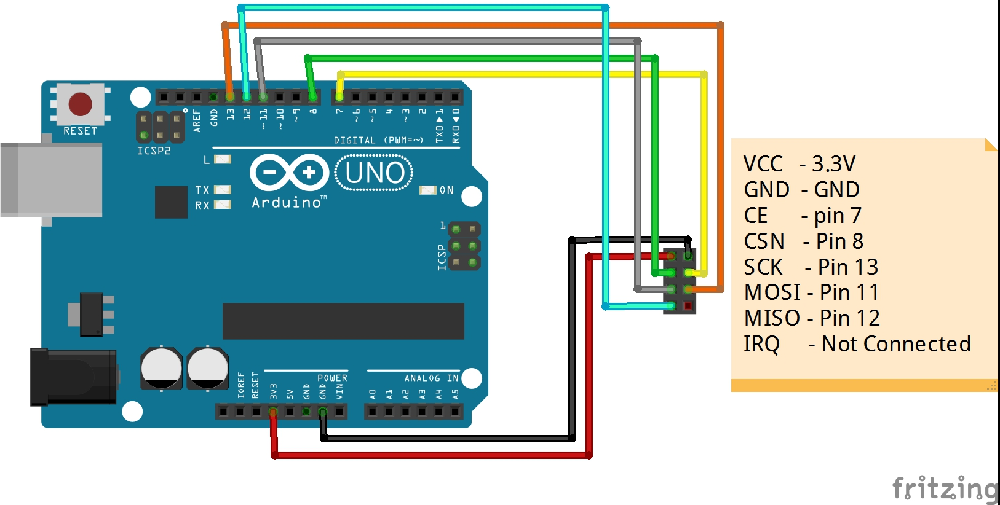
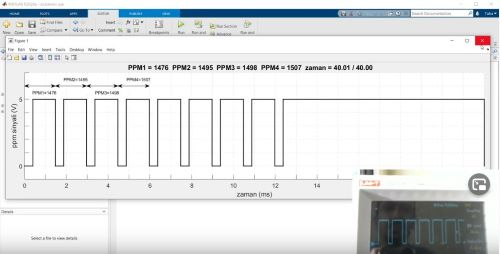

# Drone kanal sinyallerinin kumandada oluşturulması, kablosuz transferi ve PPM sinyalinin osiloskop olmadan gerçek zamanlı görselleştirilmesi
# Verici (transmitter) işlevi gören NRF24L01 + PA ve Arduino (Arduino 1)

 İlk önce 1. Arduino'muz olan transmitter (yani verici) Arduino'muza transmitter.ino kodunu yükleyelim. 
Unutmayın joysticklerin çıkış bacaklarını Arduino'nun {A0, A1, A2, A3} analog giriş pinlerine bağlamalısınız. 
NRF24L01+PA modülünü adaptörüne takın ve adaptörün CE çıkışını Arduino'nun Digital 7 (D7), CSN çıkışını Arduino'nun D8, SCK çıkışını Arduino'nun D13, MO çıkışını D11 ve de MI çıkışını Arduino'nun D12 girişine bağlayın. 
Ayrıca NRF24L01 adaptörünün üzerindeki Vcc çıkışını Arduino'nun 5V, GND çıkışını Arduino'nun GND pinine bağlayın. 
NRF24L01 Adaptörünün Vcc çıkışını 3.3V'a bağlamayın. Zaten adaptör 5V'dan 3.3V'a voltajı regüle ediyor ve ayrıca stabil (yani kararlı ve güvenilir) bir voltaj sağlıyor. 
Eğer NRF24L01 adaptörünüz yoksa bağlantıları yine bahsedilen konfigürasyonda yapabilirsiniz ama Vcc ile GND arasına 10uF'lık elektrolitik kapasitör bağlamanız tavsiye ediliyor. 
Sadece NRF24L01 kullanıyorsanız (adaptörünüz yoksa) SAKIN Vcc'ye 5V bağlamayın, NRF24L01'e zarar verirsiniz.
  
NRF24L01 kablosuz modül 
https://www.direnc.net/nrf24l01-wireless-modul 
NRF24L01kablosuz modül adaptörü 
https://www.direnc.net/8-pin-nrf24l01-wireless-modul-adaptoru 
NRF24L01 + PA kablosuz modülü (daha kuvvetli bir iletişim - anten var) 
https://www.direnc.net/nrf24l01-plus-pa-wireless-modul

# Alıcı (Receiver) işlevi gören NRF24L01 + Arduino (Arduino 2)
Yukarıda anlatılan verici (transmitter) kodunu yükledikten sonra 2. Arduino'ya receiver.ino kodunu yükleyin ve Arduino IDE ayarlar --> port --> COMX 
Burada X 2. Arduino'nun COM numarası, sakın transmitter olan 1. Arduino'nun COM adresini seçmeyin. Doğru COM numarasını seçtikten sonra sağ üstte seri port penceresini açıp sağ altta seri port iletişim hızı olan baud rate'i 57600 seçin.  
# Arduino --> MATLAB Seri Port iletişimi ile kanal sinyallerinin görselleştirilmesi
Ardından MATLAB kodumuz olan serial_port_receiver.m dosyasını doğru port ismini girerek çalıştırın. Doğru portu belirlemek için MATLAB'ı açınca serialportlist komutunu kullanabilirsiniz veya Windows'da Aygıt Yöneticisi'ne gidip orada Bağlantı Noktaları (COM ve LPT) üzerine tıklayabilirsiniz. Kodun içinde stopTime değişkenine istediğiniz değeri vererek ppm sinyalinin ekranınızda gerçek zamanlı gözlemleyebilirsiniz.
Yukarıda Code yazan yeşil bağlantıya tıklarsanız bu sayfadaki kodları zip dosyası halinde bilgisayarınıza indirebilirsiniz. 
   
   
# Videoyu aşağıdaki resime tıklayarak izleyebilirsiniz 
  
